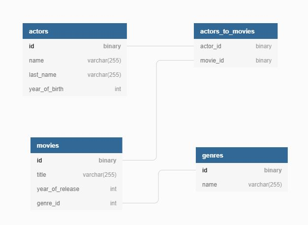

# Exercise # 5  - Hibernate

Using the Hibernate library and postgresql database, perform the following tasks :

Verify that you have PostgreSQL server (version > 9.6.25) and any sql client to connect to the PostgreSQL server pre-installed. If you don't have you can download the installer from [Here](https://www.enterprisedb.com/downloads/postgres-postgresql-downloads). The installer includes the PostgreSQL server, pgAdmin: a graphical tool for managing and developing your databases.

1. Create classes representing entities with relationships described in the diagram.

        
     - the identifier for each class has to be the automatically generated UUID.  
     - set the owner of the many-to-many relationship to the Actor class (i.e. mappedBy is in the Movie class)  
     - all tables have to be created by Hibernate at application startup

2. Issue a separate base class that will represent a common way of mapping an entity identifier. Use the @MappedSuperclass annotation.

3. Implement the GenreRepository class which will be responsible for:

      - adding Genre records to the database
      - deleting records of type Genre from the database
      - searching records by name
      - searching for records by identifier
      - returning all records  

  In this and the following tasks, assume that a correctly initialized object of type EntityManager comes in the constructor of the Repository class. Remember to create a transaction when modifying objects in the database.

4. Implement the ActorRepository class which will be responsible for:

      - saving objects of type Actor to the database
      - look for objects in the database of type Actor by identifier
      - search for objects in the Actor type database that were born after a certain year (i.e. the year is a method parameter)
      - look for objects in the database of the Actor type, the names of which end with the specified value of theString type object  

5. Implement the MovieRepository class which will be responsible for:

    - adding Movie records to the database
    - removing Movie records from the database
    - searching records by title
    - searching for records by identifier
    - returning all records
    - retrieving all records with actors appearing in it (do left join fetch in the query)
